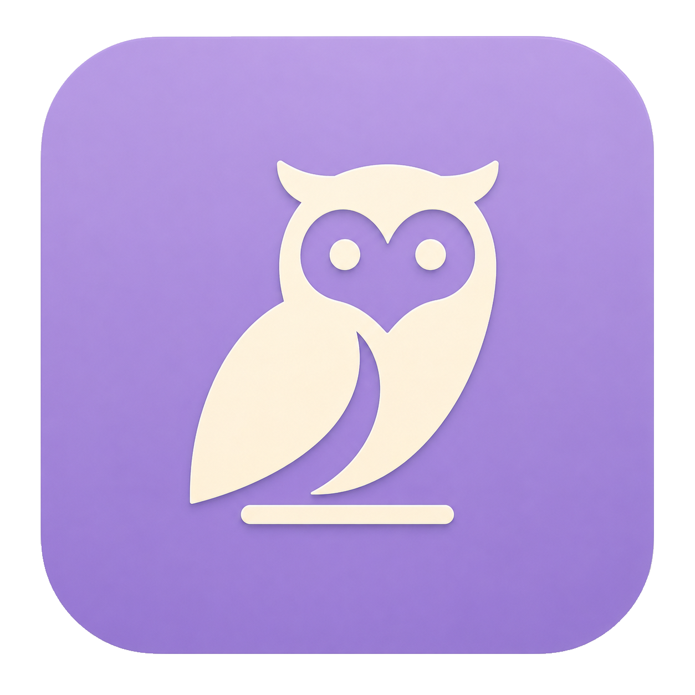

<p align="center">
  
</p>

<h1 align="center">Lumo</h1>

<p align="center">
  Seguimiento familiar sencillo, privado y pensado para Android.
</p>

<p align="center">
  <a href="https://github.com/Roger08G/lumo/actions/workflows/ci.yml"></a>
  <a href="https://github.com/Roger08G/lumo/releases"></a>
  <a href="https://github.com/Roger08G/lumo/stargazers"></a>
  <a href="https://github.com/Roger08G/lumo/network/members"></a>
  
  
  
  <a href="LICENSE"></a>
</p>

Lumo es una aplicación de seguimiento familiar con tres experiencias: **controlador**, **controlado** y **debug local**. El diseño está pensado para que una persona mayor pueda consultar una ubicación, recibir avisos de llegada y pedir ayuda sin navegar por menús complejos.

## Funciones

- Emparejamiento mediante QR de un solo uso y PIN de seis cifras.
- Varios controladores para un controlado; los permisos se validan en el servidor.
- Ubicación en segundo plano, cola cifrada offline y reintentos acotados.
- Lugares habituales con geocercas, dirección, colores e iconos configurables.
- Avisos de llegada, tiempo de trayecto, última actividad y solicitud de ayuda.
- Alarma de ayuda en el controlador, con deslizador para detenerla, llamada y localización.
- Caché local cifrada para mostrar la última información disponible sin inventar datos nuevos.
- Modo debug aislado para probar ubicaciones, permisos, batería y notificaciones sin tocar un grupo remoto.

## Arquitectura

```text
Lumo
├── mobile/                         Tauri + React + Emotion
│   └── src-tauri/                  comandos, autorización y puente Android
├── plugins/tauri-plugin-lumo-mobile puente Kotlin, ubicación y Android Keystore
├── crates/lumo-core/               dominio, PIN, geocercas y eventos
├── crates/lumo-protocol/           contrato v2, credenciales y sobres cifrados
├── crates/lumo-runtime/            SQLite local, HTTPS y flujos de emparejamiento
├── crates/lumo-api/                API Axum multi-grupo con SQLite
├── scripts/                        gates locales y despliegue reproducible
└── docs/                           backend local y despliegue del servidor
```

El frontend sólo presenta snapshots. La autoridad para grupos, roles, PIN, invitaciones y estado remoto está en Rust y en la API. Un dispositivo controlado nunca recibe la clave del estado canónico del controlador: envía operaciones tipadas y cifradas.

## Seguridad y privacidad

- HTTPS obligatorio; se rechaza tráfico cleartext en Android.
- Credenciales aleatorias por dispositivo, revocables y almacenadas cifradas.
- PIN protegido con Argon2id y bloqueo por dispositivo, no como secreto del QR.
- QR sin nombres, teléfonos ni PIN; las invitaciones caducan y sólo se consumen una vez.
- Estado del controlador cifrado con XChaCha20-Poly1305 y claves de miembro separadas.
- La clave maestra del servidor sólo vive en el VPS y nunca se compila en el APK.
- Backups Android desactivados para datos de seguimiento y credenciales.
- SQLite está pensado para una instancia del servicio; el proxy y el firewall deben limitar el acceso al puerto interno.

La API conserva el último estado cifrado y aplica límites de tamaño, cuota, expiración, CAS, ETag y protección contra replay. La retención de actividad de 24 horas es lógica de la aplicación; no es un sistema de archivado histórico ilimitado.

## Requisitos de desarrollo

- Windows, Linux o macOS.
- Rust estable compatible con `rust-toolchain.toml`.
- Bun 1.3.14 o posterior.
- JDK 17, Android SDK/NDK y Gradle para generar APK.
- Docker Engine y Docker Compose 2.24.4 o posterior sólo para la API.

## Ejecutar localmente

Frontend:

```bash
cd mobile
bun install --frozen-lockfile
bun run dev
```

Backend local y binarios de prueba:

```powershell
powershell -NoProfile -ExecutionPolicy Bypass -File .\scripts\verify-local-backend.ps1
```

```bash
./scripts/verify-local-backend.sh
```

El gate comprueba formato, compilación, Clippy sin avisos, pruebas, builds y los `self-test` de `lumo-controller`, `lumo-controlled` y `lumo-debug` usando transporte local. No necesita una API pública.

## Configuración remota

En el cliente sólo se declara el origen HTTPS de la API:

```dotenv
LUMO_RUNTIME_MODE=remote
LUMO_API_URL=https://api.example.com
```

La clave maestra, certificados y límites del servidor se configuran únicamente en `.env` del VPS. Consulta [`docs/backend-local.md`](docs/backend-local.md) para el contrato y [`docs/deploy.md`](docs/deploy.md) para Docker, Nginx, Cloudflare, backups y rollback. No subas `.env`, certificados ni keystores al repositorio.

## Android y release

Para desarrollo:

```bash
cd mobile
bun run tauri android dev
```

La release oficial se publica en [GitHub Releases](https://github.com/Roger08G/lumo/releases) con APK firmado, código fuente y SHA-256. El APK distribuido actualmente se construye para `arm64-v8a`; comprueba la arquitectura del teléfono antes de instalarlo.

## CI y dependencias

GitHub Actions ejecuta Frontend, Rust y Container en cada push y pull request. Dependabot propone actualizaciones semanalmente; los saltos mayores se aceptan sólo cuando pasan los tres jobs y se revisan sus cambios de API.

## Licencia

Lumo se distribuye bajo los términos de [`LICENSE`](LICENSE).

> Lumo no sustituye a los servicios de emergencia ni a un sistema médico. La disponibilidad de ubicación en segundo plano depende de Android, de los permisos concedidos, de la batería y de las políticas de ahorro de energía del fabricante.

