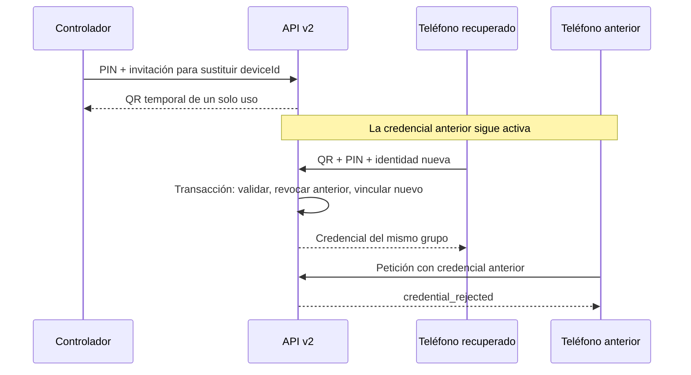

# Arquitectura y recuperación de Lumo

Lumo conserva la interfaz de Android y separa la presentación, las reglas de negocio,
el transporte y la persistencia. La API v2 es la autoridad del grupo. Una caché del
teléfono permite consultar información anterior; no autoriza cambios sin servidor.

## Responsabilidades

| Capa | Responsabilidad | Límite |
| --- | --- | --- |
| `mobile/src/app/state` | Reducer, arranque, sincronización y preferencias de presentación | No guarda credenciales nativas ni decide permisos remotos |
| `mobile/src/shared/services` | Adaptación de snapshots, errores y comandos Tauri | Ordena mutaciones y descarta lecturas que quedaron obsoletas |
| `mobile/src-tauri` | Ciclo de vida del dispositivo, incorporación al grupo y comandos tipados | La recuperación termina antes de presentar el dispositivo como configurado o sin configurar |
| `plugins/tauri-plugin-lumo-mobile` | Keystore, servicios, ubicación, notificaciones y cola Android | Un fallo temporal de lectura no elimina credenciales |
| `crates/lumo-core` | Dominio, PIN, lugares, geocercas, eventos y solicitudes de ubicación | No depende de HTTP, React ni Android |
| `crates/lumo-protocol` | Contrato v2, firmas, cifrado y roles de dispositivo | Distingue rechazo de credencial y fallo criptográfico |
| `crates/lumo-runtime` | Repositorios, credenciales, caché y reintentos HTTP | Conserva operaciones pendientes para reintentos idempotentes |
| `crates/lumo-api` | Autenticación, autorización, cuotas y transacciones SQLite | Revalida roles dentro de la transacción que modifica el estado |

## Recuperar un teléfono controlado

Si Android tarda en abrir el almacén seguro, el arranque muestra el error y permite
reintentar. No interpreta ese fallo como una instalación nueva ni elimina la clave.

Si el teléfono perdió sus datos de forma permanente:

1. El controlador abre la invitación del grupo y elige reconectar o sustituir el
   teléfono controlado, usando el PIN del grupo.
2. La invitación queda vinculada al identificador del teléfono que se sustituirá.
   Crear el QR todavía no revoca ese teléfono.
3. El controlado escanea el QR e introduce el PIN.
4. La API comprueba invitación, token, PIN, emisor y dispositivo que se sustituye.
   En una sola transacción revoca la credencial anterior, consume la invitación e
   incorpora el teléfono recuperado al mismo grupo.
5. Un QR antiguo no puede sustituir al teléfono que se haya vinculado después.

## Concurrencia y fallos

- Las lecturas del frontend no pueden sobrescribir una mutación posterior.
- El sondeo del estado espera a que termine la petición anterior y se suspende al
  ocultar la aplicación; los servicios Android mantienen el trabajo en segundo plano.
- Las escrituras de credenciales y caché no eliminan el archivo válido antes de
  instalar el reemplazo.
- Una petición de ubicación sólo se completa con una muestra capturada desde su
  creación. Descargar una muestra anterior de la cola offline no satisface la petición.
- El servidor vuelve a comprobar la autorización al escribir, para que una petición
  autenticada antes de una revocación no pueda modificar el grupo después de ella.

## Despliegue y compatibilidad

La API sigue usando `/v2`. `replaceDeviceId` es opcional: los clientes que no lo envían
mantienen la política anterior, que impide sustituir un controlado de forma implícita.
La recuperación requiere actualizar primero la API y después el cliente.

SQLite conserva el grupo y migra la tabla de invitaciones. Antes de actualizar un
servidor real se necesita una copia consistente de su volumen. Los scripts de
despliegue y las instrucciones operativas están en [deploy.md](deploy.md).

La publicación de código fuente no actualiza automáticamente una API desplegada ni
la aplicación instalada en un teléfono.
